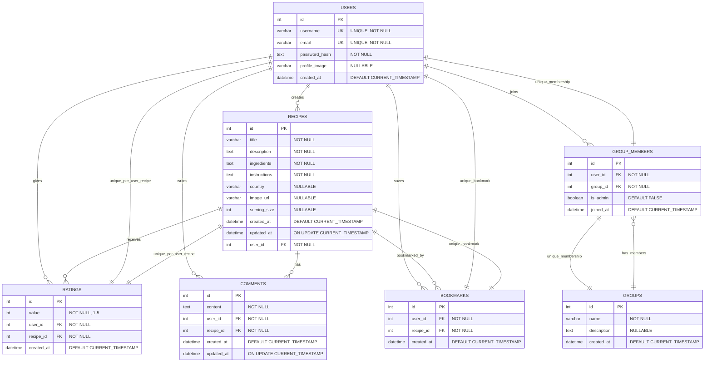

## Implementation Status Legend

| Symbol | Status | Description |
|--------|---------|-------------|
| ✅ | **Active** | Fully implemented and tested |
| 🟡 | **Partial** | Models exist but not fully utilized |
| ❌ | **Planned** | Not yet implemented |

## Current Database Tables

### ✅ Active Tables
- **users** - User accounts and authentication
- **recipes** - Recipe storage and management  
- **ratings** - Recipe rating system
- **groups** - Group/community structure and management
- **group_members** - Group membership management

### 🟡 Partial Tables  
- (none)

### ❌ Planned Tables
- **comments** - Recipe comments (empty file exists)
- **bookmarks** - Recipe favorites (empty file exists)

## Business Rules

1. **Rating Constraints**:
   - One rating per user per recipe
   - Rating values: 1-5 stars only
   - Users cannot rate their own recipes (not enforced yet)

2. **Recipe Ownership**:
   - Only recipe creators can update/delete their recipes
   - All users can view all recipes
   - All authenticated users can rate recipes

3. **Group Management**:
   - Users can join multiple groups
   - Groups can have multiple admin users
   - Unique membership per user per group
   - Only group admins can update group details
   - Only group admins can remove members
   - Only group admins can promote/demote other members
   - Group creators are automatically admins

4. **Authentication**:
   - Unique usernames and emails required
   - Password hashing with PBKDF2-SHA256
   - JWT tokens for API authentication

## API Coverage

### ✅ Implemented Endpoints
- User registration and login
- Full Recipe CRUD operations
- Recipe rating system  
- Recipe filtering (country, rating, serving size)
- Full Group CRUD operations
- Group membership management (join, leave, admin promotion/demotion)
- Group member management (remove members)

### 🟡 Partially Available
- (none)

### ❌ Not Yet Implemented  
- Comments API
- Bookmarks API
- User profile management
